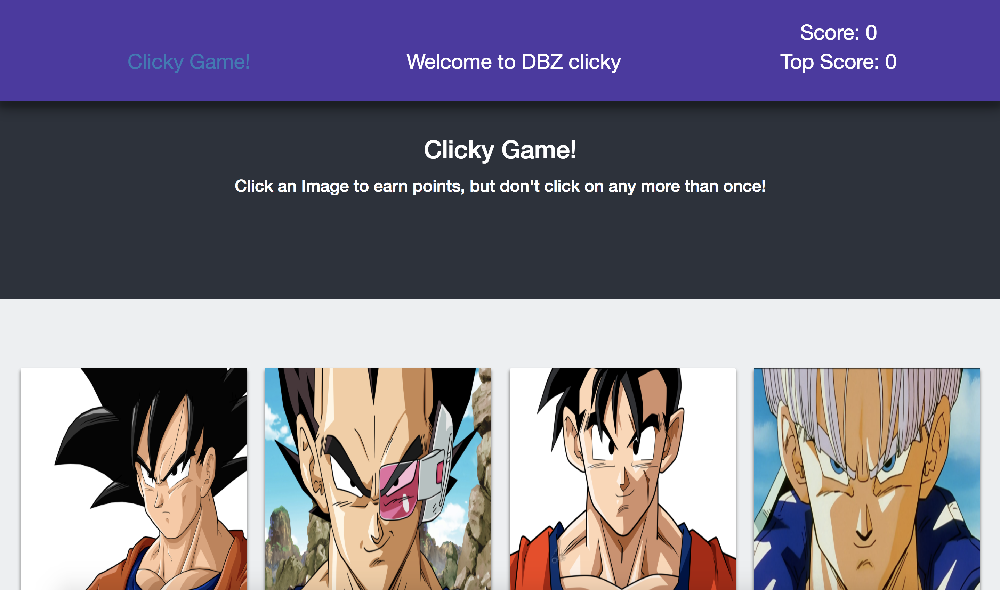
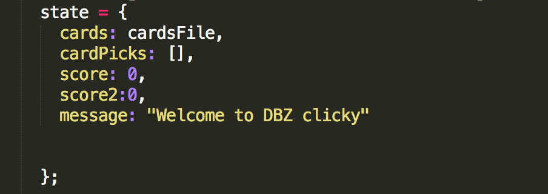
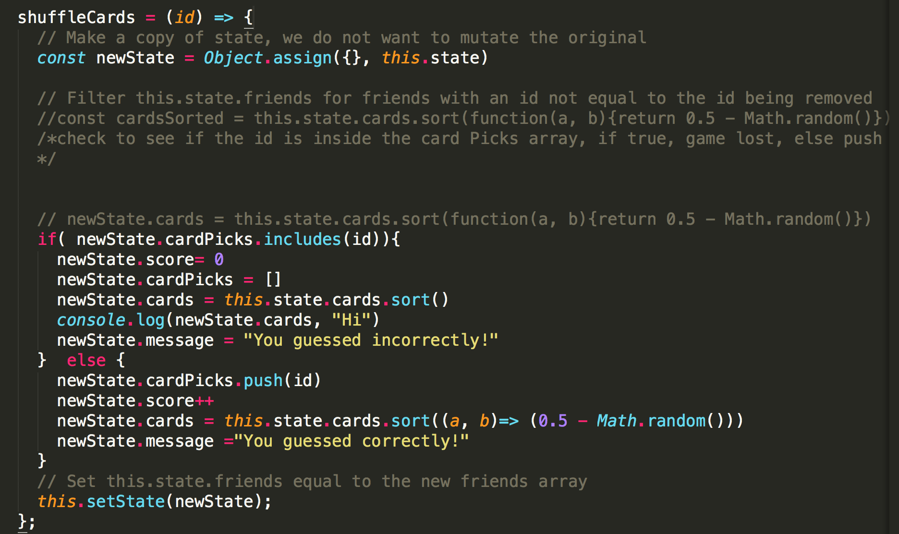
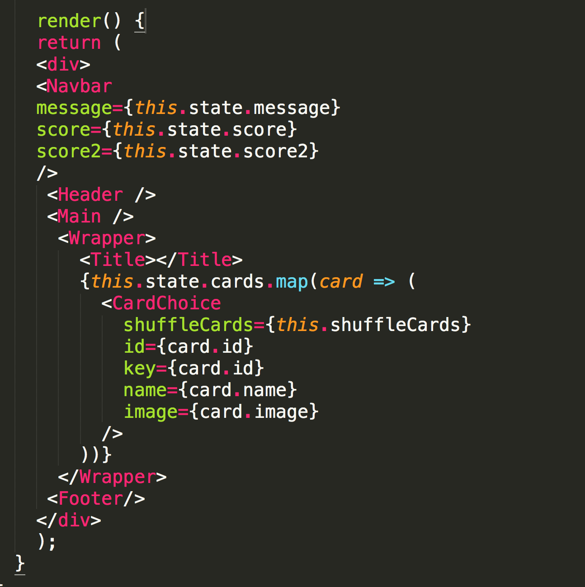
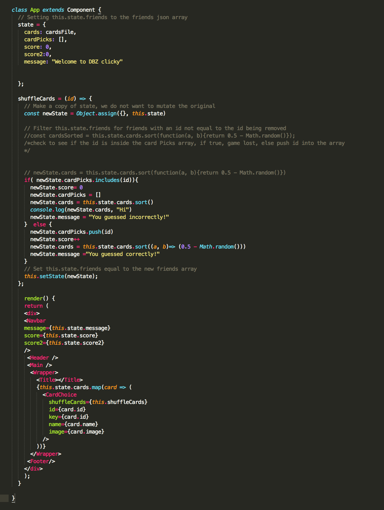

Click-Game!

Clicky-Game is a an game app that allows users to click on zn image tile of a dragon ball z character to earn points. For each character's photo clicked, a user will earn a point towards their score. When the user clicks the character's image twice, the user's score will go back to 0.

While a message is shown when a the user clicks on a character to earn a point toward's their score, upon further development, the game  would notify the user when the game is won and when the user earns all of the points they could earn.

Instructions on how to build this app:

This app was built with JavaScript

Libraries and Frameworks:

JavaScript
React 
BootStrap
HTML
CSS

Installation:

1. In the the bash command line terminal, run the command "create-react-app <'app-name'>". This will install the react library within app-name's directory and put the folder structure together that's needed for the build.

2. Within the directory is a 'src' folder where you will make another directory and call it 'components'. 'components' is where to put structural pieces of the app.

3. Components should contain js files for the html/css needed to build the app such as the header, navbar, footer, wrapper and whichever other pieces needed to build the frontend.

4. Within the root of the directory, create a json file and write an array of objects each containing the id, name, and image urls for the clickable elements of the game.

5. Each component to build the rendition of the app is exported to into the app js file that exists upon creation of the react app.

Code:

          

